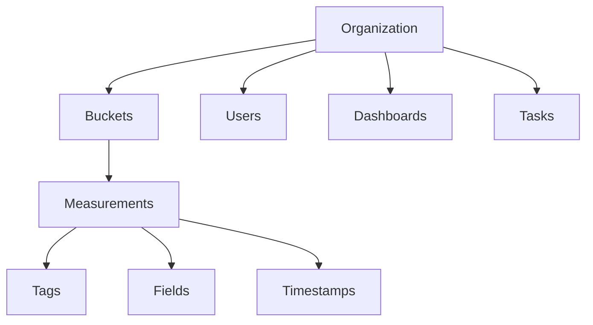

# InfluxDB 2.x - Diagram & Visual Representation Guide

## Comprehensive Diagram Suggestions for Your Presentation

This document provides diagram suggestions, pictorial representations, and useful links that complement the InfluxDB 2.x Comprehensive Learning Notes.

---

## 📊 Section-wise Diagram Recommendations

### 1. Introduction to InfluxDB 2

#### Diagram Suggestions:

- **InfluxDB Logo and Product Family Overview**
- **Time Series Database Comparison Chart** (InfluxDB vs others)
- **InfluxDB 1.x vs 2.x Migration Diagram**

#### Recommended Visuals:

```
[Create a simple comparison table showing:]
+------------------+------------------+------------------+
| Feature          | InfluxDB 1.x     | InfluxDB 2.x     |
+------------------+------------------+------------------+
| Data Container   | Database + RP    | Bucket           |
| Query Language   | InfluxQL         | Flux + InfluxQL  |
| UI               | Chronograf       | Built-in         |
| Auth             | Username/Pass    | Tokens           |
| Tasks            | CQs              | Tasks            |
+------------------+------------------+------------------+
```

#### Official Resources:

- **InfluxDB Overview Presentation**: https://www.slideshare.net/influxdata/influxdb-concepts-and-architecture-michael-desa-influxdata
- **Official Docs - Get Started**: https://docs.influxdata.com/influxdb/v2/get-started/

---

### 2. Core Concepts & Data Model

#### Essential Diagrams:

**A. Organization Hierarchy Diagram**

```
Organization (MyCompany)
├── Users
│   ├── Admin
│   └── Members
├── Buckets
│   ├── sensor-data (30d retention)
│   ├── analytics (infinite retention)
│   └── monitoring (7d retention)
├── Dashboards
├── Tasks
└── Alerts
```

**B. Bucket → Measurement → Data Flow**

```
Bucket: "iot-sensors"
└── Measurement: "temperature"
    ├── Tags (Indexed - Fast Query)
    │   ├── location=bangalore
    │   ├── device_id=DHT22-001
    │   └── building=HQ
    └── Fields (Not Indexed - Actual Data)
        ├── value=25.5
        ├── humidity=60
        └── battery=85
    └── Timestamp: 2024-12-14T10:30:00Z
```

**C. Data Model - Complete Picture**

```
┌─────────────────────────────────────────────────────┐
│                   ORGANIZATION                      │
│  ┌───────────────────────────────────────────────┐ │
│  │              BUCKET (sensor-data)             │ │
│  │  ┌─────────────────────────────────────────┐ │ │
│  │  │   MEASUREMENT (temperature)              │ │ │
│  │  │                                          │ │ │
│  │  │   POINT (Single Data Record)             │ │ │
│  │  │   ┌──────────────────────────────────┐  │ │ │
│  │  │   │ Timestamp: 2024-12-14 10:30:00Z  │  │ │ │
│  │  │   │                                  │  │ │ │
│  │  │   │ Tags: (Indexed Metadata)        │  │ │ │
│  │  │   │   location = bangalore          │  │ │ │
│  │  │   │   device_id = DHT22-001         │  │ │ │
│  │  │   │   sensor_type = DHT22           │  │ │ │
│  │  │   │                                  │  │ │ │
│  │  │   │ Fields: (Measured Values)       │  │ │ │
│  │  │   │   temperature = 25.5            │  │ │ │
│  │  │   │   humidity = 60                 │  │ │ │
│  │  │   │   battery = 85                  │  │ │ │
│  │  │   └──────────────────────────────────┘  │ │ │
│  │  └─────────────────────────────────────────┘ │ │
│  └───────────────────────────────────────────────┘ │
└─────────────────────────────────────────────────────┘
```

**D. Series Cardinality Visualization**

```
Series = Measurement + Tag Set

Example:
Measurement: temperature (1)
Tags:
  location: 3 values (bangalore, mumbai, delhi)
  device_type: 2 values (DHT22, BME280)
  status: 2 values (active, inactive)

Total Series = 1 × 3 × 2 × 2 = 12 series ✓ Good

If you add sensor_id with 10,000 unique values:
Total Series = 1 × 3 × 2 × 2 × 10,000 = 120,000 series ✗ High Cardinality!
```

#### Official Documentation Links:

- **Data Elements**: https://docs.influxdata.com/influxdb/v2/reference/key-concepts/data-elements/
- **Data Schema**: https://docs.influxdata.com/influxdb/v2/reference/key-concepts/data-schema/
- **Schema Design**: https://docs.influxdata.com/influxdb/cloud/write-data/best-practices/schema-design/

#### Visual Tools:

- Use **draw.io** or **Lucidchart** to create these diagrams
- **Mermaid.js** for code-based diagrams:



---

### 3. Architecture & Design Principles

#### Critical Diagrams:

**A. Storage Engine Architecture (TSM)**

```
┌─────────────────────────────────────────────────────────┐
│                    WRITE REQUEST                        │
│                         ↓                               │
│            ┌────────────────────────┐                   │
│            │   HTTP API Endpoint    │                   │
│            │    /api/v2/write       │                   │
│            └───────────┬────────────┘                   │
│                        ↓                                │
│     ┌──────────────────────────────────────┐           │
│     │  WAL (Write-Ahead Log) - Disk        │           │
│     │  • Durability                        │           │
│     │  • fsync() for safety                │           │
│     └──────────────┬───────────────────────┘           │
│                    ↓                                    │
│     ┌──────────────────────────────────────┐           │
│     │  CACHE (In-Memory)                   │           │
│     │  • Fast queries                      │           │
│     │  • Recent data                       │           │
│     └──────────────┬───────────────────────┘           │
│                    ↓ (Periodic flush)                   │
│     ┌──────────────────────────────────────┐           │
│     │  TSM FILES (Time-Structured Merge)   │           │
│     │  • Compressed storage (10:1 ratio)   │           │
│     │  • Columnar format                   │           │
│     │  • Sorted by time                    │           │
│     └──────────────┬───────────────────────┘           │
│                    ↓ (Background)                       │
│     ┌──────────────────────────────────────┐           │
│     │  COMPACTION                          │           │
│     │  • Merge small TSM files             │           │
│     │  • Optimize storage                  │           │
│     └──────────────────────────────────────┘           │
└─────────────────────────────────────────────────────────┘
```

**B. Query Execution Flow**

```
┌─────────────────────────────────────────────────────────┐
│                    QUERY REQUEST                        │
│                         ↓                               │
│            ┌────────────────────────┐                   │
│            │   HTTP API Endpoint    │                   │
│            │    /api/v2/query       │                   │
│            └───────────┬────────────┘                   │
│                        ↓                                │
│     ┌──────────────────────────────────────┐           │
│     │  QUERY PLANNER                       │           │
│     │  • Parse Flux query                  │           │
│     │  • Optimize execution plan           │           │
│     └──────────────┬───────────────────────┘           │
│                    ↓                                    │
│     ┌──────────────────────────────────────┐           │
│     │  INDEX SCAN (TSI)                    │           │
│     │  • Tag-based filtering               │           │
│     │  • Fast series lookup                │           │
│     └──────────────┬───────────────────────┘           │
│                    ↓                                    │
│  ┌─────────────────┴────────────────┐                  │
│  │                                  │                  │
│  ▼                                  ▼                  │
│ Cache                            TSM Files             │
│ (Recent)                        (Historical)           │
│  │                                  │                  │
│  └─────────────────┬────────────────┘                  │
│                    ↓                                    │
│     ┌──────────────────────────────────────┐           │
│     │  QUERY ENGINE                        │           │
│     │  • Aggregation                       │           │
│     │  • Filtering                         │           │
│     │  • Transformation                    │           │
│     └──────────────┬───────────────────────┘           │
│                    ↓                                    │
│            ┌────────────────────────┐                   │
│            │     RESULT SET         │                   │
│            │   (Annotated CSV)      │                   │
│            └────────────────────────┘                   │
└─────────────────────────────────────────────────────────┘
```

**C. File System Layout**

```
/var/lib/influxdb2/
├── engine/                    # Storage engine data
│   ├── data/                 # TSM files
│   │   ├── bucket-id-1/
│   │   │   ├── autogen/
│   │   │   │   ├── 1/
│   │   │   │   │   ├── 000000001-000000001.tsm
│   │   │   │   │   └── 000000002-000000001.tsm
│   │   ├── _series/          # Series file
│   │   └── _internal/        # System metrics
│   ├── wal/                  # Write-ahead log
│   │   ├── bucket-id-1/
│   │   │   └── _00001.wal
│   └── replicationq/         # Replication queue
└── influxd.bolt              # Metadata (BoltDB)
    └── Contains: Users, Orgs, Buckets, Tokens
```

#### Official Resources:

- **Storage Engine**: https://docs.influxdata.com/influxdb/v2/reference/internals/storage-engine/
- **File System Layout**: https://docs.influxdata.com/influxdb/v2/reference/internals/file-system-layout/
- **Shards & Shard Groups**: https://docs.influxdata.com/influxdb/v2/reference/internals/shards/

#### Recommended Diagram:

Create a layered architecture diagram showing:

1. API Layer
2. Query/Write Engine
3. Storage Layer (WAL, Cache, TSM)
4. Disk Storage

---

### 4. Data Writing Process

#### Flow Diagrams:

**A. Write Path - From Client to Disk**

```
┌──────────────────────────────────────────────────────────────┐
│  CLIENT APPLICATION                                          │
│  ┌────────────────────────────────────────────────────────┐ │
│  │ Point: temperature,location=bangalore value=25.5       │ │
│  └─────────────────────────┬──────────────────────────────┘ │
└────────────────────────────┼─────────────────────────────────┘
                             ↓
         ┌───────────────────────────────────────┐
         │  HTTP POST /api/v2/write              │
         │  Authorization: Token YOUR_TOKEN      │
         │  Content-Type: text/plain             │
         └───────────────┬───────────────────────┘
                         ↓
         ┌───────────────────────────────────────┐
         │  InfluxDB Server                      │
         │  1. Validate token & permissions      │
         │  2. Parse line protocol               │
         │  3. Write to WAL (fsync)              │
         │  4. Write to in-memory cache          │
         │  5. Return 204 No Content             │
         └───────────────┬───────────────────────┘
                         ↓
      ┌──────────────────────────────────┐
      │  Background Process               │
      │  • Flush cache to TSM files       │
      │  • Compact TSM files              │
      │  • Remove old data (retention)    │
      └───────────────────────────────────┘
```

**B. Batch Writing Best Practice**

```
BAD: Individual Writes                 GOOD: Batch Writes
─────────────────────                 ──────────────────
for (i=0; i<1000; i++)                points = []
  write(point[i])      ✗              for (i=0; i<1000; i++)
  // 1000 HTTP calls                    points.push(point[i])
  // Slow!                             write(points)  ✓
                                       // 1 HTTP call
                                       // Fast!

Performance Impact:
Individual: ~10 writes/sec
Batch:      ~50,000 writes/sec (5000x faster!)
```

#### Official Resources:

- **Write Data**: https://docs.influxdata.com/influxdb/v2/write-data/
- **Best Practices - Optimize Writes**: https://docs.influxdata.com/influxdb/v2/write-data/best-practices/optimize-writes/
- **Line Protocol**: https://docs.influxdata.com/influxdb/v2/reference/syntax/line-protocol/

---

### 5. Querying with Flux

#### Visualization Suggestions:

**A. Flux Query Pipeline**

```
┌─────────────────────────────────────────────────────────┐
│  from(bucket: "sensors")                                │
│    ↓                                                    │
│  |> range(start: -1h)                                  │
│    ↓                                                    │
│  |> filter(fn: (r) => r._measurement == "temperature") │
│    ↓                                                    │
│  |> filter(fn: (r) => r.location == "bangalore")      │
│    ↓                                                    │
│  |> aggregateWindow(every: 5m, fn: mean)              │
│    ↓                                                    │
│  |> yield(name: "result")                              │
└─────────────────────────────────────────────────────────┘

Data Transformation at Each Stage:
1. from(): Select data source (bucket)
2. range(): Filter by time → 60 min of data
3. filter(): Measurement filter → 1 measurement
4. filter(): Tag filter → 1 location subset
5. aggregateWindow(): Aggregate → 12 points (5min each)
6. yield(): Return results
```

**B. Flux Function Categories**

```
┌────────────────────────────────────────────────┐
│           FLUX FUNCTION CATEGORIES             │
├────────────────────────────────────────────────┤
│                                                │
│  INPUT                   OUTPUT                │
│  ├─ from()              ├─ to()                │
│  ├─ sql.from()          ├─ influxdb.to()       │
│  └─ csv.from()          └─ experimental.to()   │
│                                                │
│  FILTER & SELECT        TRANSFORM              │
│  ├─ range()             ├─ map()               │
│  ├─ filter()            ├─ set()               │
│  ├─ keep()              ├─ rename()            │
│  └─ drop()              └─ duplicate()         │
│                                                │
│  AGGREGATE              SHAPE                  │
│  ├─ mean()              ├─ group()             │
│  ├─ sum()               ├─ window()            │
│  ├─ count()             ├─ pivot()             │
│  ├─ min() / max()       └─ join()              │
│  └─ aggregateWindow()                          │
│                                                │
│  SELECT                 TIME                   │
│  ├─ first()             ├─ timeShift()         │
│  ├─ last()              ├─ truncateTimeColumn()│
│  ├─ limit()             └─ date.truncate()     │
│  └─ tail()                                     │
└────────────────────────────────────────────────┘
```

#### Official Resources:

- **Get Started with Flux**: https://docs.influxdata.com/influxdb/v2/query-data/get-started/
- **Flux Documentation**: https://docs.influxdata.com/flux/
- **Common Flux Queries**: https://docs.influxdata.com/influxdb/v2/query-data/common-queries/

---

### 6. Data Processing & Tasks

#### Task Workflow Diagram:

```
┌──────────────────────────────────────────────────────┐
│                  TASK EXECUTION                      │
├──────────────────────────────────────────────────────┤
│                                                      │
│  Task Definition (Flux Script)                      │
│  ┌────────────────────────────────────────────┐    │
│  │ option task = {                            │    │
│  │   name: "downsample",                      │    │
│  │   every: 1h,        ← Runs every hour      │    │
│  │   offset: 5m        ← 5 min after hour     │    │
│  │ }                                          │    │
│  └────────────────────────────────────────────┘    │
│                    ↓                                │
│  ┌────────────────────────────────────────────┐    │
│  │ Scheduler (Internal)                       │    │
│  │ • Monitors task schedule                   │    │
│  │ • Triggers execution at specified time     │    │
│  └────────────┬───────────────────────────────┘    │
│               ↓                                     │
│  ┌────────────────────────────────────────────┐    │
│  │ Task Execution                             │    │
│  │ from(bucket: "raw")                        │    │
│  │   |> range(start: -task.every)             │    │
│  │   |> aggregateWindow(every: 5m, fn: mean)  │    │
│  │   |> to(bucket: "downsampled")             │    │
│  └────────────┬───────────────────────────────┘    │
│               ↓                                     │
│  ┌────────────────────────────────────────────┐    │
│  │ Success/Failure Log                        │    │
│  │ • Run ID                                   │    │
│  │ • Timestamp                                │    │
│  │ • Status (success/failed)                  │    │
│  │ • Error message (if failed)                │    │
│  └────────────────────────────────────────────┘    │
└──────────────────────────────────────────────────────┘
```

#### Downsampling Strategy:

```
┌──────────────────────────────────────────────────────┐
│            DATA RETENTION STRATEGY                    │
├──────────────────────────────────────────────────────┤
│                                                       │
│  Raw Data (High Resolution)                          │
│  ┌─────────────────────────────────────┐            │
│  │ Bucket: raw-data                    │            │
│  │ Retention: 7 days                   │            │
│  │ Interval: Every 10 seconds          │            │
│  │ Storage: ~604,800 points/week       │            │
│  └───────────────┬─────────────────────┘            │
│                  ↓ (Task runs hourly)                │
│  ┌─────────────────────────────────────┐            │
│  │ Bucket: hourly-data                 │            │
│  │ Retention: 90 days                  │            │
│  │ Interval: 5-minute averages         │            │
│  │ Storage: ~25,920 points/90days      │            │
│  └───────────────┬─────────────────────┘            │
│                  ↓ (Task runs daily)                 │
│  ┌─────────────────────────────────────┐            │
│  │ Bucket: long-term-data              │            │
│  │ Retention: Infinite                 │            │
│  │ Interval: Hourly averages           │            │
│  │ Storage: ~8,760 points/year         │            │
│  └─────────────────────────────────────┘            │
│                                                       │
│  Total Storage Reduction: 99.9%                      │
└──────────────────────────────────────────────────────┘
```

#### Official Resources:

- **Tasks**: https://docs.influxdata.com/influxdb/v2/process-data/
- **Downsample Data**: https://docs.influxdata.com/influxdb/v2/process-data/common-tasks/downsample-data/

---

### 7. Monitoring & Alerting

#### Alert Flow Diagram:

```
┌────────────────────────────────────────────────────────┐
│              MONITORING & ALERTING FLOW                │
├────────────────────────────────────────────────────────┤
│                                                        │
│  1. CHECK (Monitor Condition)                         │
│  ┌──────────────────────────────────────────────┐    │
│  │ from(bucket: "sensors")                      │    │
│  │   |> range(start: -5m)                       │    │
│  │   |> filter(fn: (r) => r._measurement ==     │    │
│  │                        "temperature")        │    │
│  │   |> mean()                                  │    │
│  │   |> check.thresholdCheck(                   │    │
│  │       thresholds: {                          │    │
│  │         crit: (r) => r._value > 35.0  ←─────┼─┐  │
│  │         warn: (r) => r._value > 30.0        │ │  │
│  │         ok:   (r) => r._value <= 30.0       │ │  │
│  │       }                                      │ │  │
│  │     )                                        │ │  │
│  └──────────────────────────────────────────────┘ │  │
│                    ↓                               │  │
│  2. STATUS UPDATE                                  │  │
│  ┌──────────────────────────────────────────────┐ │  │
│  │ Status: CRIT (Temperature > 35°C)            │ │  │
│  │ Level: CRITICAL                              │ │  │
│  │ Message: "High temperature detected!"        │ │  │
│  └──────────────────────────────────────────────┘ │  │
│                    ↓                               │  │
│  3. NOTIFICATION RULE                              │  │
│  ┌──────────────────────────────────────────────┐ │  │
│  │ IF status == "CRIT"                          │ │  │
│  │   THEN send to endpoint                      │ │  │
│  └──────────────────────────────────────────────┘ │  │
│                    ↓                               │  │
│  4. NOTIFICATION ENDPOINT                          │  │
│  ┌──────────────────────────────────────────────┐ │  │
│  │ Slack / PagerDuty / HTTP / Email             │ │  │
│  │                                              │ │  │
│  │ Message: "⚠️ Alert: Temperature is 36.5°C    │ │  │
│  │          at location: Server Room A"         │ │  │
│  └──────────────────────────────────────────────┘ │  │
│                                                    │  │
│  5. INCIDENT MANAGEMENT ────────────────────────────┘  │
│  ┌──────────────────────────────────────────────┐    │
│  │ • Team receives notification                 │    │
│  │ • Investigate issue                          │    │
│  │ • Take corrective action                     │    │
│  │ • Temperature returns to normal              │    │
│  │ • Status changes to OK                       │    │
│  │ • Resolution notification sent               │    │
│  └──────────────────────────────────────────────┘    │
└────────────────────────────────────────────────────────┘
```

#### Official Resources:

- **Monitor & Alert**: https://docs.influxdata.com/influxdb/v2/monitor-alert/
- **Checks**: https://docs.influxdata.com/influxdb/v2/monitor-alert/checks/
- **Notification Endpoints**: https://docs.influxdata.com/influxdb/v2/monitor-alert/notification-endpoints/

---

### 8. Administration & Security

#### Security Architecture:

```
┌──────────────────────────────────────────────────────┐
│         INFLUXDB SECURITY LAYERS                     │
├──────────────────────────────────────────────────────┤
│                                                       │
│  1. NETWORK LAYER                                    │
│  ┌─────────────────────────────────────────────┐    │
│  │ TLS/HTTPS Encryption                        │    │
│  │ Firewall Rules                              │    │
│  │ VPN/Private Network                         │    │
│  └─────────────────────────────────────────────┘    │
│                    ↓                                 │
│  2. AUTHENTICATION                                   │
│  ┌─────────────────────────────────────────────┐    │
│  │ Token-based Authentication                  │    │
│  │ • Operator Token (Super Admin)              │    │
│  │ • All-Access Token (Org Level)              │    │
│  │ • Read/Write Token (Bucket Level)           │    │
│  └─────────────────────────────────────────────┘    │
│                    ↓                                 │
│  3. AUTHORIZATION (Permissions)                      │
│  ┌─────────────────────────────────────────────┐    │
│  │ Resource-based Access Control               │    │
│  │                                             │    │
│  │ Token: read-sensors                         │    │
│  │ ├─ read: bucket/sensor-data                 │    │
│  │ └─ read: bucket/analytics                   │    │
│  │                                             │    │
│  │ Token: write-sensors                        │    │
│  │ ├─ write: bucket/sensor-data                │    │
│  │ └─ read: bucket/sensor-data                 │    │
│  └─────────────────────────────────────────────┘    │
│                    ↓                                 │
│  4. DATA ISOLATION                                   │
│  ┌─────────────────────────────────────────────┐    │
│  │ Organization: Company-A                     │    │
│  │ └─ Users: user1, user2                      │    │
│  │ └─ Buckets: production, staging             │    │
│  │                                             │    │
│  │ Organization: Company-B                     │    │
│  │ └─ Users: user3, user4                      │    │
│  │ └─ Buckets: iot-data, analytics             │    │
│  └─────────────────────────────────────────────┘    │
└──────────────────────────────────────────────────────┘
```

#### Official Resources:

- **Manage Security**: https://docs.influxdata.com/influxdb/v2/admin/security/
- **Manage Tokens**: https://docs.influxdata.com/influxdb/v2/admin/tokens/
- **Enable TLS**: https://docs.influxdata.com/influxdb/v2/admin/security/enable-tls/

---

### 9. Integration Architecture

#### System Integration Diagram:

```
┌─────────────────────────────────────────────────────────────┐
│                  DATA COLLECTION LAYER                      │
├─────────────────────────────────────────────────────────────┤
│                                                             │
│  ┌─────────┐  ┌─────────┐  ┌─────────┐  ┌──────────┐     │
│  │ IoT     │  │ App     │  │ System  │  │ External │     │
│  │ Sensors │  │ Metrics │  │ Logs    │  │ APIs     │     │
│  └────┬────┘  └────┬────┘  └────┬────┘  └────┬─────┘     │
│       │            │            │            │            │
│       └────────────┴────────────┴────────────┘            │
│                         ↓                                  │
└─────────────────────────────────────────────────────────────┘
                          ↓
┌─────────────────────────────────────────────────────────────┐
│                    COLLECTION AGENTS                        │
├─────────────────────────────────────────────────────────────┤
│  ┌──────────┐  ┌───────────┐  ┌────────────┐             │
│  │ Telegraf │  │  Client   │  │   Custom   │             │
│  │  Agent   │  │ Libraries │  │  Scrapers  │             │
│  └─────┬────┘  └─────┬─────┘  └──────┬─────┘             │
│        │             │                │                    │
│        └─────────────┴────────────────┘                    │
│                      ↓                                     │
└─────────────────────────────────────────────────────────────┘
                      ↓
┌─────────────────────────────────────────────────────────────┐
│                     INFLUXDB 2.x                            │
├─────────────────────────────────────────────────────────────┤
│  ┌─────────────────────────────────────────────────────┐  │
│  │            Storage Engine (TSM)                     │  │
│  │  • High-compression time series storage             │  │
│  │  • Automatic downsampling (Tasks)                   │  │
│  └─────────────────────────────────────────────────────┘  │
└─────────────────────────────────────────────────────────────┘
                      ↓
┌─────────────────────────────────────────────────────────────┐
│                  VISUALIZATION LAYER                        │
├─────────────────────────────────────────────────────────────┤
│  ┌───────────┐  ┌──────────┐  ┌──────────────┐           │
│  │ InfluxDB  │  │ Grafana  │  │   Custom     │           │
│  │    UI     │  │          │  │   Dashboards │           │
│  └───────────┘  └──────────┘  └──────────────┘           │
└─────────────────────────────────────────────────────────────┘
                      ↓
┌─────────────────────────────────────────────────────────────┐
│                   ALERTING & ACTIONS                        │
├─────────────────────────────────────────────────────────────┤
│  ┌─────────┐  ┌──────────┐  ┌───────────┐  ┌──────────┐  │
│  │  Slack  │  │PagerDuty │  │  Email    │  │ Webhooks │  │
│  └─────────┘  └──────────┘  └───────────┘  └──────────┘  │
└─────────────────────────────────────────────────────────────┘
```

#### Official Resources:

- **Tools & Integrations**: https://docs.influxdata.com/influxdb/v2/tools/
- **Telegraf**: https://docs.influxdata.com/telegraf/
- **Grafana Integration**: https://docs.influxdata.com/influxdb/v2/tools/grafana/

---

## 🎨 Recommended Tools for Creating Diagrams

### 1. **Draw.io (diagrams.net)** - FREE

- **Link**: https://app.diagrams.net/
- **Best for**: Architecture diagrams, flowcharts
- **Features**:
  - Free and open-source
  - Web-based or desktop
  - Pre-built templates
  - Export to PNG, SVG, PDF

### 2. **Lucidchart** - FREE & PAID

- **Link**: https://www.lucidchart.com/
- **Best for**: Professional diagrams
- **Features**:
  - Collaborative editing
  - Templates for system architecture
  - Integration with Google Drive

### 3. **Mermaid.js** - FREE (Code-based)

- **Link**: https://mermaid.js.org/
- **Best for**: Code-generated diagrams
- **Live Editor**: https://mermaid.live/
- **Features**:
  - Create diagrams from text
  - Version control friendly
  - Flowcharts, sequence diagrams, ER diagrams

### 4. **Excalidraw** - FREE

- **Link**: https://excalidraw.com/
- **Best for**: Hand-drawn style diagrams
- **Features**:
  - Simple and intuitive
  - Collaborative
  - Export to PNG, SVG

### 5. **PlantUML** - FREE

- **Link**: https://plantuml.com/
- **Best for**: UML diagrams, sequence diagrams
- **Online Editor**: http://www.plantuml.com/plantuml/uml/

---

## 📸 Suggested Diagram Screenshots/Examples

### For Data Model Section:

```
Search: "time series database data model diagram"
Recommended: Create custom diagram showing:
- Organization → Buckets → Measurements → Tags/Fields/Timestamps
```

### For Architecture Section:

```
Official InfluxDB Architecture Diagram:
- Check InfluxData presentations on SlideShare
- Link: https://www.slideshare.net/influxdata
```

### For Flux Query Section:

```
Create pipeline visualization showing:
Input → Transform → Aggregate → Output
```

---

## 🔗 Additional Official Resources

### Video Resources:

1. **InfluxDB YouTube Channel**: https://www.youtube.com/@influxdata

   - Getting Started tutorials
   - Architecture deep dives
   - Use case presentations

2. **InfluxDB University**: https://university.influxdata.com/
   - Free courses with visual content
   - Certification programs

### Documentation with Diagrams:

1. **Storage Engine**: https://docs.influxdata.com/influxdb/v2/reference/internals/storage-engine/
2. **Shards & Shard Groups**: https://docs.influxdata.com/influxdb/v2/reference/internals/shards/
3. **File System Layout**: https://docs.influxdata.com/influxdb/v2/reference/internals/file-system-layout/

### Community Resources:

1. **GitHub**: https://github.com/influxdata/influxdb
2. **Community Forums**: https://community.influxdata.com/
3. **SlideShare Presentations**: https://www.slideshare.net/influxdata

---

## 💡 Tips for Creating Effective Diagrams

1. **Keep it Simple**: Don't overcrowd diagrams
2. **Use Colors**: Different colors for different components
3. **Add Legends**: Explain symbols and colors
4. **Flow Direction**: Top-to-bottom or left-to-right
5. **Consistent Style**: Use same style throughout presentation
6. **Real Examples**: Use actual data examples, not abstract ones
7. **Annotations**: Add brief explanations to complex parts

---

## 📋 Presentation Structure Recommendation

### Slide Layout Suggestion:

**Slide 1-3**: Introduction

- What is InfluxDB
- Use cases diagram
- v1 vs v2 comparison table

**Slide 4-8**: Core Concepts

- Data model hierarchy diagram
- Tag vs Field comparison
- Series cardinality visualization
- Line protocol examples

**Slide 9-12**: Architecture

- Storage engine flow
- Query execution path
- File system layout

**Slide 13-16**: Writing Data

- Write path diagram
- Client integration examples
- Batch vs individual writes comparison

**Slide 17-22**: Querying

- Flux pipeline visualization
- Function categories
- Common query patterns

**Slide 23-25**: Processing & Tasks

- Task workflow
- Downsampling strategy

**Slide 26-28**: Monitoring

- Alert flow diagram
- Check examples

**Slide 29-31**: Integration

- System architecture
- Tool ecosystem

**Slide 32-35**: Best Practices

- Schema design patterns
- Performance tips
- Real-world use cases

---

## ✅ Summary

This guide provides comprehensive diagram suggestions for every section of your InfluxDB 2.x notes. Use the official documentation links for accurate information and the recommended tools to create professional diagrams for your presentation.

**Pro Tip**: Start with simple diagrams and progressively add detail as you explain each concept. This keeps your audience engaged and helps them understand complex topics step by step.

Good luck with your presentation! 🚀
